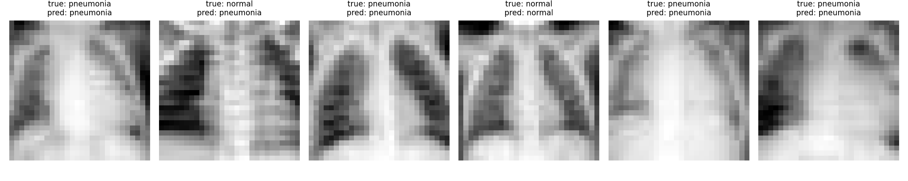

# PneumoniaMNIST Classifier

A deep learning project that uses a Convolutional Neural Network (CNN) built with PyTorch to classify chest X-ray images as **Normal** or **Pneumonia** using the PneumoniaMNIST (MedMNIST v2) dataset.

---

## Overview

This project demonstrates an end-to-end medical image classification pipeline, including data preprocessing, model training, evaluation and prediction using PyTorch — plus a web interface so the trained model can actually be used, not only described.

---

## Dataset

- **Name:** PneumoniaMNIST (MedMNIST v2)
- **Image Size:** 28 × 28 grayscale
- **Classes:** Normal, Pneumonia

**Dataset:** https://medmnist.com/

---

## Project Workflow

1. Prepare the PneumoniaMNIST dataset.
2. Preprocess chest X-ray images.
3. Train a Convolutional Neural Network (CNN).
4. Evaluate the trained model.
5. Generate predictions on unseen test images.
6. Save the trained model for future inference.
7. Serve the model through a web interface.

---

## Tech Stack

- Python
- PyTorch
- Torchvision
- MedMNIST
- NumPy
- Matplotlib
- Flask

---

## Model

A custom CNN built with PyTorch for binary chest X-ray classification.

```
Conv2d(1 -> 16, 3x3)  -> ReLU -> MaxPool     28x28 -> 14x14
Conv2d(16 -> 32, 3x3) -> ReLU -> MaxPool     14x14 -> 7x7
Flatten -> Linear(1568 -> 64) -> ReLU -> Dropout(0.3) -> Linear(64 -> 1)
```

105,281 parameters. Binary cross-entropy with logits, Adam at `lr=1e-3`, batch size 64. Inference takes under a millisecond per image on CPU.

---

## Results

Measured on the 624-image held-out test set:

| Metric | Value | What it means |
|---|---|---|
| Accuracy | 83.3% | overall correct |
| Sensitivity | 99.5% | of patients with pneumonia, how many were caught |
| Specificity | 56.4% | of healthy patients, how many were correctly cleared |
| AUC | 0.934 | how well the model separates the two classes |

Confusion matrix:

```
                  predicted normal   predicted pneumonia
true normal                    132                   102
true pneumonia                   2                   388
```

### Reading these numbers honestly

Accuracy on its own is misleading here. The test set is 62.5% pneumonia, so always guessing "pneumonia" would already score 62.5%.

The real story is in the other two numbers. The model catches 388 of 390 pneumonia cases, but flags 102 of 234 healthy patients as sick. It is heavily biased toward predicting pneumonia.

That bias is not a training failure. An AUC of 0.934 means the model separates the two classes well — the problem is the decision threshold. Anything above a predicted probability of 0.5 is called pneumonia, and 0.5 is simply not the right cut-off for this model. Raising it would trade a little sensitivity for a large gain in specificity.

There is also a gap between validation accuracy (96.4%) and test accuracy (83.3%). The cause is a distribution shift built into the dataset: the train and validation splits are 74.2% pneumonia, while the test split is 62.5%. A model that leans toward guessing pneumonia looks better on validation than it deserves to.

### Sample Predictions



---

## Installation

```bash
pip install -r requirements.txt
```

---

## Usage

```bash
python train.py
```

Downloads the dataset automatically, trains for 10 epochs, prints test accuracy, and saves `pneumonia_model.pth` along with a grid of sample predictions. Takes about 40 seconds on CPU.

---

## Web App

A single-page interface for uploading a chest X-ray and getting a prediction from the trained model.

- **Backend** — Flask API that loads the trained weights and runs inference
- **Frontend** — HTML, CSS and vanilla JavaScript, no build step

Every value shown in the interface comes from the model or the uploaded file; there is no placeholder or simulated data. The wording deliberately stays inside what the model can support — it reports a probability of pneumonia, and does not claim to identify a cause, localise findings, or rule out other conditions.

### Running it

You need two terminal windows open at the same time.

**Terminal 1 — start the model:**

```bash
cd app/backend
python app.py
```

**Terminal 2 — start the web page:**

```bash
cd app/frontend
python3 -m http.server 8000
```

Now open **http://127.0.0.1:8000** in your browser.

---

## Project Structure

```
train.py                   training script
pneumonia_detector.ipynb   exploration notebook
pneumonia_model.pth        trained weights
app/
  backend/app.py           Flask inference API
  frontend/                web interface
  sample_xrays/            test images
```

---

## Limitations

1. **Images are 28 × 28.** PneumoniaMNIST is heavily downsampled. Real chest X-rays are far higher resolution, and the fine detail a radiologist relies on is simply not present in this data.
2. **The threshold is untuned.** Fixed at 0.5, which as shown above is the main cause of the low specificity.
3. **No cross-validation.** A single train/test split, so the reported numbers carry more uncertainty than they appear to.
4. **Binary output only.** The model cannot distinguish bacterial from viral pneumonia, localise findings, or detect any other condition.

---

## Future Work

- Tune the decision threshold using the ROC curve instead of defaulting to 0.5 — the highest-impact change, given the specificity problem above.
- Improve model accuracy through hyperparameter tuning.
- Apply data augmentation to improve generalization.
- Experiment with deeper CNN architectures and pretrained models (e.g., ResNet18).

---

## Disclaimer

Research and educational project. **Not a medical device and not for clinical use.**

---

## Contact and Feedback

**Data Analyst:** Shruti Pingle

**LinkedIn:** [Profile](https://www.linkedin.com/in/shruti-pingle-aa8034196)

**Email:** [shrutipingle02\@gmail.com](mailto:shrutipingle02@gmail.com)
